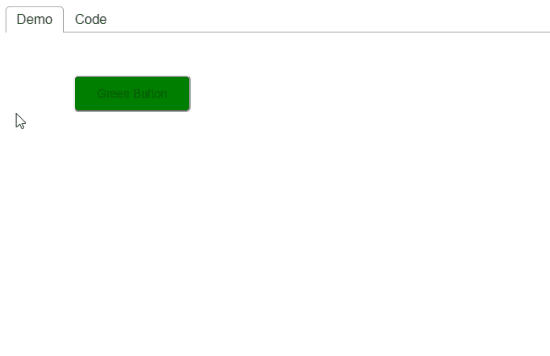

# React DemoTab 📑

[![npm version][npm-badge]][npm-url]
[![Build Status][build-badge]][build-url]

_React component to easily create demos of other components_

## Install

npm `npm install -D react-demo-tab`  
yarn `yarn add -D react-demo-tab`

## Example



```jsx
import React from 'react';
import ReactDOM from 'react-dom';
import DemoComponent from './ButtonGreen';

const demoComponentCode = `
import React from 'react';
import './ButtonGreen.css';

const ButtonGreen = () => <button className="btn-green">Green Button</button>;
export default ButtonGreen;`;

const demoComponentStyle = `
.btn-green {
  background-color: green;
  font-size: 14px;
  padding: 12px 26px;
  border-radius: 6px;
}`;

const App = () => {
  return (
    <DemoTab code={demoComponentCode} style={demoComponentStyle} codeExt="jsx" styleExt="css">
      <DemoComponent />
    </DemoTab>
  );
};

ReactDOM.render(<App />, document.getElementById('root'));
```

## Props

Create a demo of a component that is passed as a child.

Below is the complete list of possible props and their options:

> ▶︎ indicates optional prop with default value

**code**: string  
Demo code. Required.

**style**: string ▶︎ `undefined`  
Demo style.

**codeExt**: 'jsx' | 'tsx' ▶︎ `jsx`  
Code file extension image to be displayed.

**styleExt**: 'css' | 'scss' ▶︎ `css`  
Style file extension image to be displayed.

## Create demos with CLI tool

Instead of manually creating demos, automate the process with [DemoTab CLI tool](https://github.com/mkosir/react-demo-tab-cli).

## Development

_Easily set up a local development environment!_

Build all the examples and starts storybook server on [localhost:9009](http://localhost:9009):

- clone
- `npm install`
- `npm start`

OR

Clone this repo on your machine, navigate to its location in the terminal and run:

```bash
npm install
npm link # link your local repo to your global packages
npm run build:watch # build the files and watch for changes
```

Clone project repo that you wish to test with react-demo-tab library and run:

```bash
npm install
npm link react-demo-tab # link your local copy into this project's node_modules
npm start
```

**Start coding!** 🎉

## Contributing

All contributions are welcome!

[npm-url]: https://www.npmjs.com/package/react-demo-tab
[npm-badge]: https://img.shields.io/npm/v/react-demo-tab.svg
[build-badge]: https://travis-ci.com/mkosir/react-demo-tab.svg
[build-url]: https://travis-ci.com/mkosir/react-demo-tab
